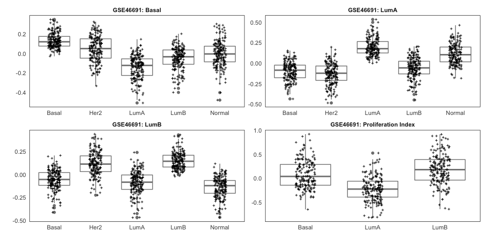

GSE46691 PAM50 Analysis
================

## Overview

[`01-build_gse46691.R`](01-build_gse46691.R)

1.  Gathers the GSE46691 data files from
    <https://www.ncbi.nlm.nih.gov/geo/query/acc.cgi?acc=GSE46691>,
2.  Builds an ExpressionSet-like object without the assay data,
3.  Matches probe id to PAM50 gene names via the gene assignments
    included in the GPL5188 annotation
4.  Imports the assay data (from the raw quantile normalized data
    files), limiting the data imported to the probes matching PAM50
    genes
5.  Transforms the data into the format appropriate for the PAM50
    analysis
6.  Writes out processed data

[`02-build_run_pam50_gse46691.R`](02-build_run_pam50_gse46691.R)

1.  Gathers PAM50 scripts from
    <https://genome.unc.edu/pubsup/breastGEO/>
2.  Organizes the data exported from step 1
3.  Creates a script to run the PAM50 analysis
4.  Optionally runs the PAM50 analysis or links to the script to run the
    analysis

[`03-pam50-extra.R`](03-pam50-extra.R)

1.  Imports the PAM50 scores data and creates two new versions:
    1.  One version where the `Call` column for predicted `Her2` samples
        is replaced with the next highest prediction
    2.  Another version where `Call` is replaced for both `Her2` and
        `Normal` with the next highest prediction
2.  Saves all three versions as R `RDS` objects

[`99-clean-up.R`](99-clean-up.R)

1.  `gse46691_clean_everything()` deletes *all input* files, meaning a
    subsequent run will need to download everything again.
2.  `gse46691_clean_outputs()` just cleans up output files for a clean
    analysis run.

## Examples

### PAM50 Results

<!-- -->

### PAM50 Her2 Replaced

<!-- -->

### PAM50 Her2, Normal Replaced

<!-- -->

## Functions

The `functions_gse46691.R` file contains several useful functions:

1.  `build_gse_46691()` is more-or-less specific to GSE46691 and builds
    an ExpressionSet-like object (a list rather than an ExpressionSet).

2.  `gpl2fd()` can be used to build the Feature Data as an
    `AnnotatedDataFrame` (in preparation for an ExpressionSet) from a
    downloaded `GPLnnnn.soft` file or just the `GPLnnnn` identifier.

3.  `tidy_gene_assignment()` takes the feature data and parses strings
    like `"NR_024005 // MGC13005 /// NR_024004 // MGC13005 /// AK093685
    // MGC13005"` into a tidy data frame with two additional columns.
    
    ``` r
    # A tibble: 10 x 4
            ID gene_assignment                                                          gene_assignment_1 gene_assignment_2
         <int> <chr>                                                                    <list>            <list>           
     1 2315101 NR_024005 // MGC13005 /// NR_024004 // MGC13005 /// AK093685 // MGC13005 <chr [3]>         <chr [3]>        
     2 2315102 NR_024004 // MGC13005 /// NR_024005 // MGC13005 /// AK093685 // MGC13005 <chr [3]>         <chr [3]>        
     3 2315103 ---                                                                      <chr [0]>         <chr [0]>        
     4 2315104 NR_024004 // MGC13005 /// NR_024005 // MGC13005 /// AK093685 // MGC13005 <chr [3]>         <chr [3]>        
     5 2315105 NR_024004 // MGC13005 /// NR_024005 // MGC13005 /// AK093685 // MGC13005 <chr [3]>         <chr [3]>        
     6 2315107 ---                                                                      <chr [0]>         <chr [0]>        
     7 2315108 XM_001722700 // LOC100132970                                             <chr [1]>         <chr [1]>        
     8 2315110 ---                                                                      <chr [0]>         <chr [0]>        
     9 2315112 ---                                                                      <chr [0]>         <chr [0]>        
    10 2315114 ---                                                                      <chr [0]>         <chr [0]> 
    ```
    
    When piped into `tidyr::unnest() %>% select(ID,
    gene_assignment_1:gene_assignment_2)` this gives a nice tidy data
    frame.
    
    |      ID | gene\_assignment\_1 | gene\_assignment\_2 |
    | ------: | :------------------ | :------------------ |
    | 2315101 | NR\_024005          | MGC13005            |
    | 2315101 | NR\_024004          | MGC13005            |
    | 2315101 | AK093685            | MGC13005            |
    | 2315102 | NR\_024004          | MGC13005            |
    | 2315102 | NR\_024005          | MGC13005            |
    | 2315102 | AK093685            | MGC13005            |
    | 2315104 | NR\_024004          | MGC13005            |
    | 2315104 | NR\_024005          | MGC13005            |
    | 2315104 | AK093685            | MGC13005            |
    | 2315105 | NR\_024004          | MGC13005            |
    | 2315105 | NR\_024005          | MGC13005            |
    | 2315105 | AK093685            | MGC13005            |
    | 2315108 | XM\_001722700       | LOC100132970        |
    

4.  `read_tsv_filtered()` is a generally-useful function that reads in a
    large TSV file in chunks and filters on-the-fly. The second argument
    is an expression like that which would be given to
    `dplyr::filter()`.

5.  `median_center()` is used to center variable values within groups
    using `dplyr::group_by()`. It assumes that the input is already
    grouped.
